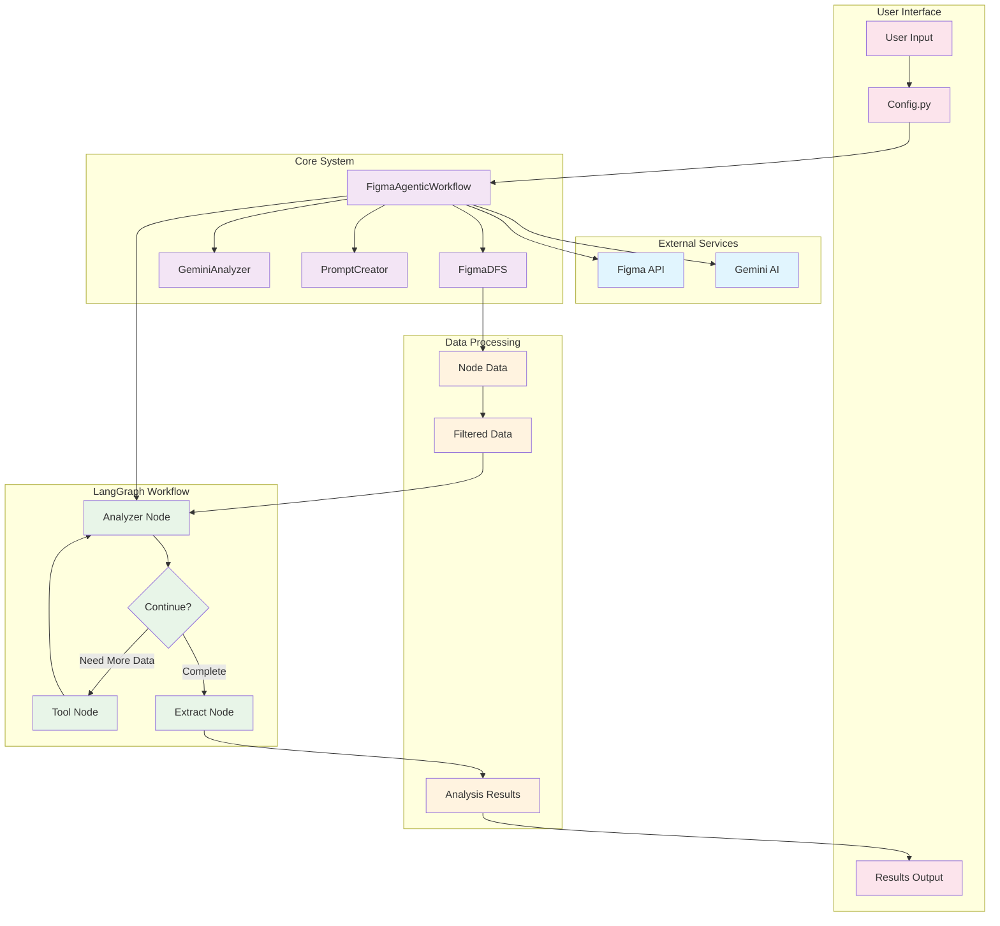
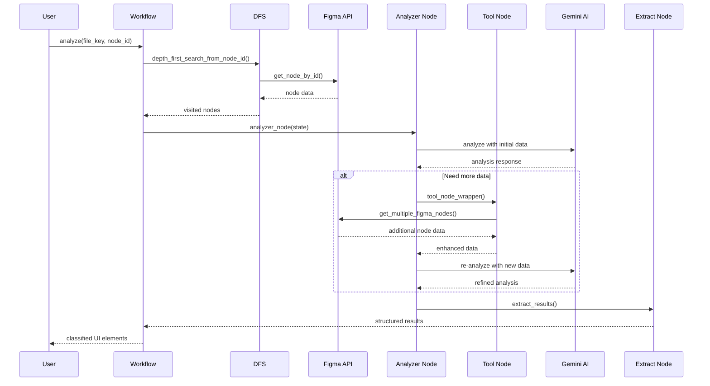
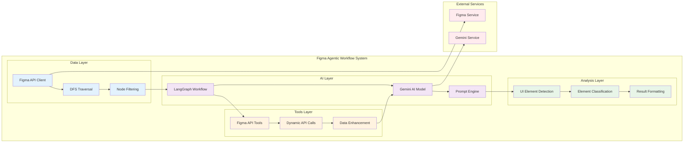

# Figma Agentic Workflow with LangGraph

A sophisticated Python library that uses Google's Gemini AI and LangGraph to intelligently analyze Figma designs and detect UI elements (inputs, buttons, links, selects) through an agentic workflow.

## 🚀 Features

- **Agentic AI Workflow**: Uses LangGraph to create intelligent agents that can call Figma APIs as tools
- **Gemini AI Integration**: Leverages Google's Gemini model for intelligent UI element detection
- **Dynamic Tool Calling**: AI agents can request additional Figma data when needed
- **Comprehensive Detection**: Identifies text inputs, buttons, links, and select elements
- **Optimized Data Processing**: Token-efficient data formatting for better AI performance
- **Detailed Logging**: Complete interaction logging with timestamped files
- **Async Processing**: Non-blocking operations for better performance

## 🏗️ Architecture Overview

The system uses a LangGraph-based workflow where Gemini AI acts as an intelligent agent that can:
1. Analyze initial Figma node data
2. Request additional data from Figma APIs when needed
3. Make informed decisions about UI element classification
4. Iteratively refine its analysis



### Workflow Sequence Diagram



### System Architecture Diagram



## 📋 Workflow Steps

### 1. **Data Preparation Phase**
- **DFS Traversal**: Performs depth-first search on Figma file structure
- **Node Optimization**: Converts Figma nodes to token-efficient format
- **Data Filtering**: Extracts only UI-relevant properties (position, styling, text, etc.)

### 2. **Agentic Analysis Phase**
- **Initial Analysis**: Gemini AI analyzes the prepared node data
- **Tool Decision**: AI determines if additional Figma data is needed
- **Dynamic API Calls**: Uses `get_multiple_figma_nodes` tool to fetch specific nodes
- **Iterative Refinement**: Continues analysis with enhanced data

### 3. **Result Extraction Phase**
- **JSON Parsing**: Extracts structured results from AI responses
- **Node ID Cleaning**: Converts verbose node IDs to clean format
- **Classification**: Organizes results by element type (input, button, link, select)

## 🛠️ Installation

1. **Clone the repository**:
```bash
git clone <repository-url>
cd locofy
```

2. **Install dependencies**:
```bash
pipenv install
```

3. **Activate the virtual environment**:
```bash
pipenv shell
```

4. **Configure your API keys** in `config.py`:
```python
FIGMA_ACCESS_TOKEN = "your_figma_access_token"
GEMINI_API_KEY = "your_gemini_api_key"
FIGMA_FILE_KEY = "your_figma_file_key"
START_NODE_ID = "your_starting_node_id" # ie The page/screen node.
```

**⚠️ Security Note**: The `config.py` file contains placeholder values. Replace them with your actual API keys:
- **Figma Access Token**: Get from [Figma Account Settings](https://www.figma.com/developers/api#access-tokens)
- **Gemini API Key**: Get from [Google AI Studio](https://makersuite.google.com/app/apikey)
- **Figma File Key**: Extract from your Figma file URL (the part after `/file/`)

**For production use**, consider using environment variables instead of hardcoding API keys:
```python
import os
FIGMA_ACCESS_TOKEN = os.getenv("FIGMA_ACCESS_TOKEN")
GEMINI_API_KEY = os.getenv("GEMINI_API_KEY")
```

## 🚀 Quick Start

### Basic Usage

```python
import asyncio
from figma_agentic_workflow import FigmaAgenticWorkflow

async def main():
    # Initialize the agentic workflow
    workflow = FigmaAgenticWorkflow()
    
    # Run the analysis
    results = await workflow.analyze(
        file_key="your_file_key",
        node_id="your_node_id",
        max_depth=None,  # No depth limit
        verbose=True,    # Show progress
    )
    
    print(f"Found {len(results)} classified elements")
    print(results)

# Run the example
asyncio.run(main())
```

### Running the Example

```bash
# Make sure you're in the virtual environment
pipenv shell

# Run the example script
python combined_gemini_example.py
```

## 📁 Project Structure

```
locofy/
├── figma_agentic_workflow.py    # Main LangGraph workflow implementation
├── combined_gemini_example.py   # Example usage script
├── figma_dfs.py                 # Figma DFS traversal utilities
├── gemini_analyzer.py           # Gemini AI analysis utilities
├── input_detection_prompts.py   # AI prompt generation
├── config.py                    # Configuration and API keys
├── config_template.py           # Template for API key setup
├── Pipfile                      # Python dependencies (pipenv)
├── Pipfile.lock                 # Locked dependencies
└── README.md                    # This file
```

## 🔧 Core Components

### FigmaAgenticWorkflow Class

The main class that orchestrates the entire agentic workflow:

```python
class FigmaAgenticWorkflow:
    def __init__(self):
        """Initialize the workflow with LangGraph setup"""
        
    async def analyze(self, file_key, node_id, max_depth=None, verbose=True):
        """Run the complete agentic analysis workflow"""
```

### LangGraph Workflow Nodes

1. **Analyzer Node**: Processes initial data and makes AI analysis decisions
2. **Tool Node**: Handles Figma API calls when AI needs more data
3. **Extract Node**: Parses and formats final results

### Available Tools

- **`get_multiple_figma_nodes`**: Fetches specific Figma nodes with UI-relevant filtering

## 🎯 Detection Capabilities

The system can identify:

- **Text Inputs**: Search bars, form fields, input containers
- **Buttons**: Primary buttons, icon buttons, action buttons
- **Links**: Clickable text links, navigation elements
- **Select Elements**: Dropdown menus, selection controls
